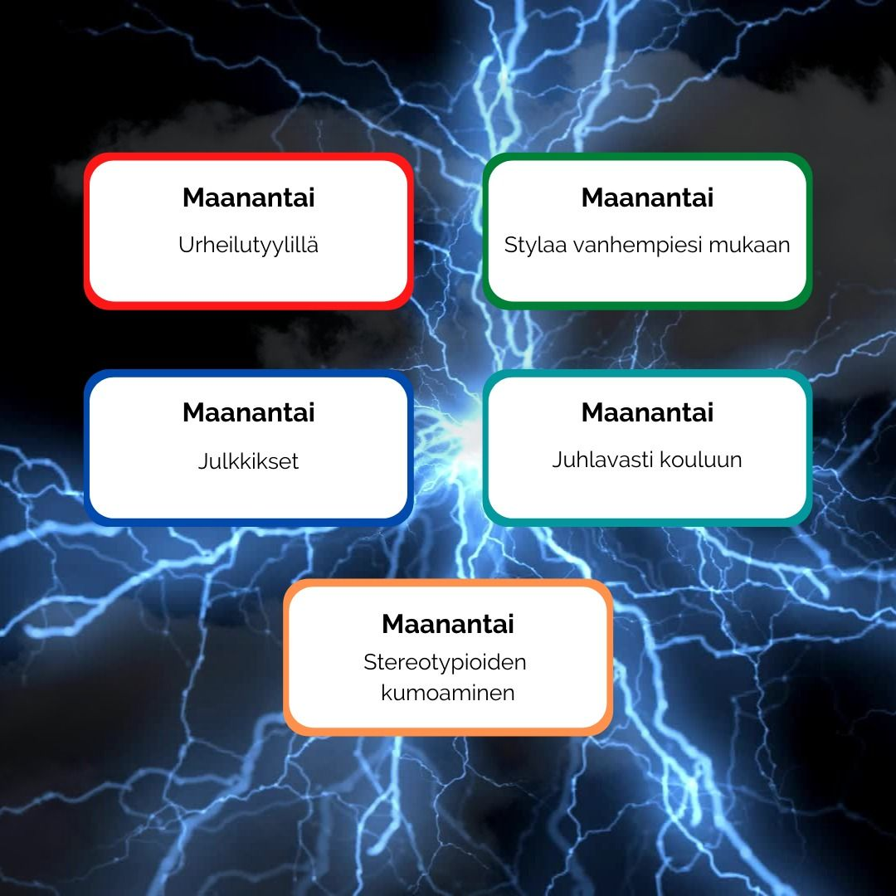

**Maanantai:**

Maanantaina pukeudeumme urheilullisesti, mutta vapaasti. Osallistu kouluun esimerkiksi lempijalkapallojoukkueesi paidassa tai muuten vain rennosti. Liikkuminen lisää hyvinvointia!

**Tiistai:**

Tiistain twistissä pääset pukeutumaan kuten omat vanhempasi! Nappaa kaapista siis retroimmat tai muuten parhaiten kuvaavat kuteet!

**Keskiviikko:**

Nykyään jokainen voi olla julkkis, myös sinä! Voit imitoida esimerkiksi lempinäyttelijääsi tai muuten kuuluisia henkilöitä.

**Torstai:**

Torstaina Hellussa järjestetään kuvitteellinen YO-kirjoitusten päätösjuhla. Pukeudu siis parhaimpiisi, sillä kaikki on kutsuttu mukaan!

**Perjantai:**

Sukupuolinormitus on menneen ajan asioita. Vapaudu ja riko normejasi, kuten parhaimmin näet!
