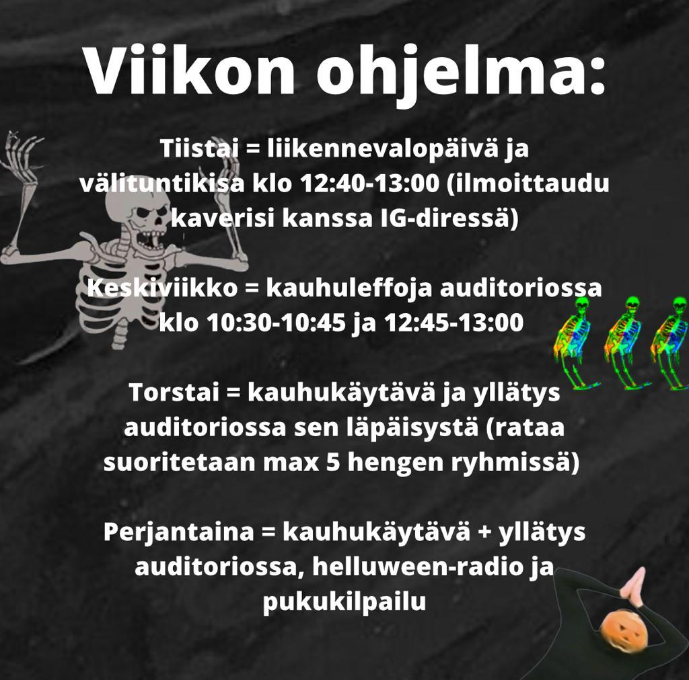
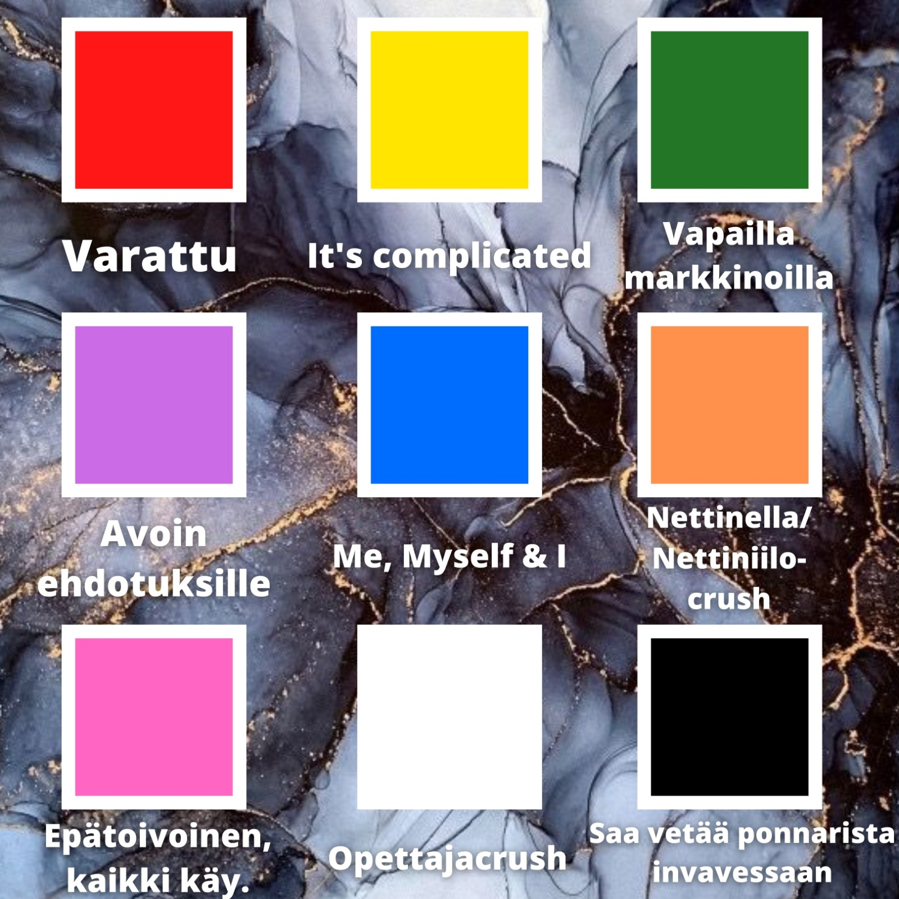

Tervetuloa viettämään hyytäviä Halloweenhupeja Helluun! OPKH on juhlan hengessä mukana ja järjestää pitkin ensi viikkoa mukavaa - siis kauhistuttavaa ohjelmaa.🎃👻

**Tiistai:**

Tiistaina on vuorossa perinteinen ja paljon toivottu liikennevalopäivä!🚦Pukeudu väriin, joka parhaiten kuvaa itseäsi! Värien merkitykset löydät postauksen kuvaosiosta.

Osallistu tiistaina myös OPKH:n rentoihin välituntikisoihin, joihin voit ilmoittautua kavereiden kanssa IG Diren kautta.👇

**Keskiviikko:**

Jos tulet keskiviikkona käymään auditoriossä välitunneilla, saatat pelästyä! OPKH esittää keskiviikkona kauhuelokuvia välkillä 10.30-10.45 ja 12.45-13.00!🍿🎬

**Torstai:**

Torstai on Helluweenin spesiaalipäivä! Opiskelijoita odottaa kellarissa kauhukäytävä, jonka läpäisijät vastaanottavat hienon yllätyksen! Kulje kauhukäytävä max 5 hengen ryhmissä ja valmistaudu pelästymään!🧟‍♂️

**Perjantai:**

Jos et ehtinyt torstaina, on myös perjantaina mahdollisuus käydä tutustumassa kauhukäytävään. Perjantaina on myös Halloweenin pukukilpailu, jonka voittajat palkitaan. Pukeudu siis hyytävimpiin kuteisiisi ja nauti samalla erityisestä Halloweenin helluradiosta!🎼
