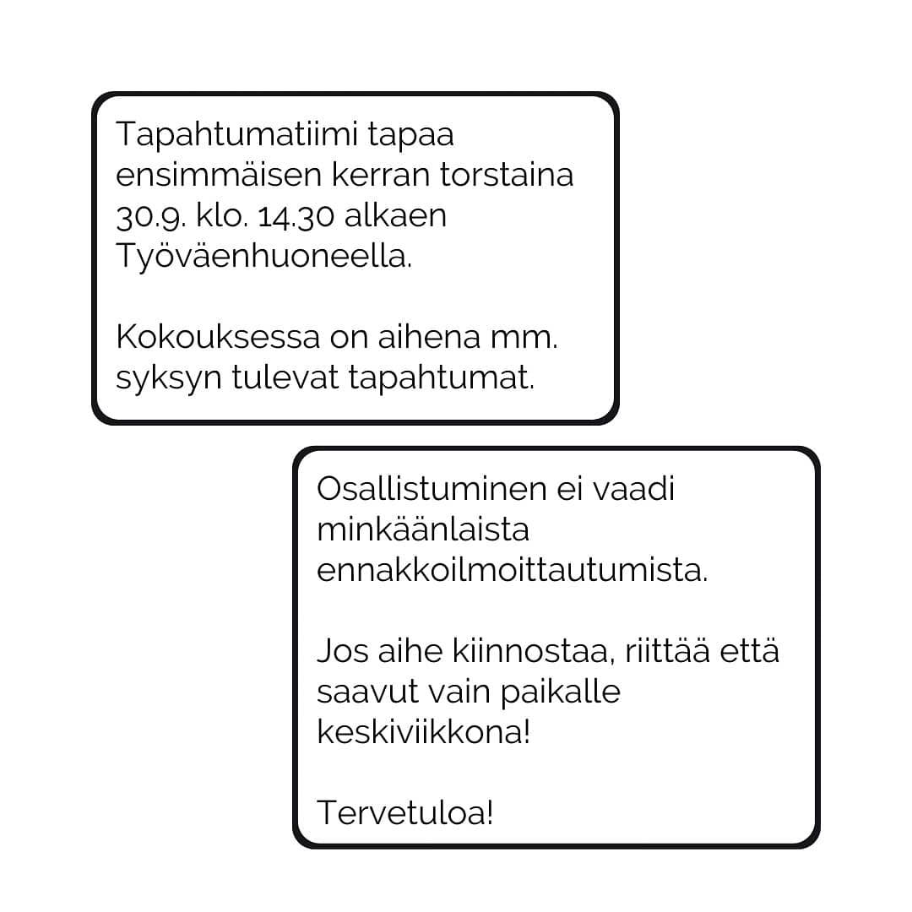

Kyllästyttääkö koulu? Tuntuvatko välitunnit vain siirtymiltä tunnilta toiselle?

Jos näin on voimme tarjota mahdollisuuden muuttaa asioita. Tapahtumatiimissä kuka tahansa pääsee suunnittelemaan koulun tapahtumia. Pääset ideoimaan, suunnittelemaan ja toteuttamaan hauskoja aktiviteetteja käytännön tasolla. Sinulla on siis mahdollisuus auttaa kehittämään koulun juhlia ja voit jopa itse ideoida omia aivan uusia tapahtumia välitunneille! Liity siis tapahtumatiimiin paremman tekemisen puutteessa.

Tiimiin ei tarvitse ennakkoilmoittautua. Saavu vain ensimmäiseen kokoukseen, joka pidetään 30.9. klo 14.30 työväenhuoneessa.

Tervetuloa mukaan!
