

Minulla on käytössä englanninkieliset käyttöliittymät, mutta periaatteessa suomenkielinen ei eroa yhtään painikkeiden sijainniltaan.

1. Mene osoitteeseen https://helsinki.inschool.fi ja kirjaudu sisään.

2. Klikkaa "työjärjestys".
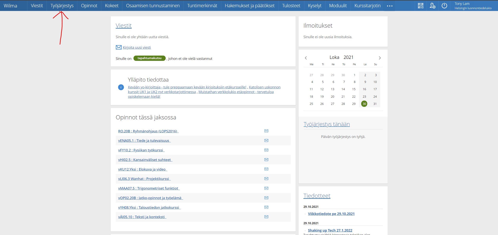
3. Klikkaa "tilaa" työjärjestyksen oikeasta yläkulmasta.
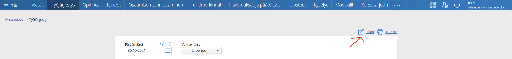
4. Kopioi linkki avautuvasta pienestä ikkunasta.
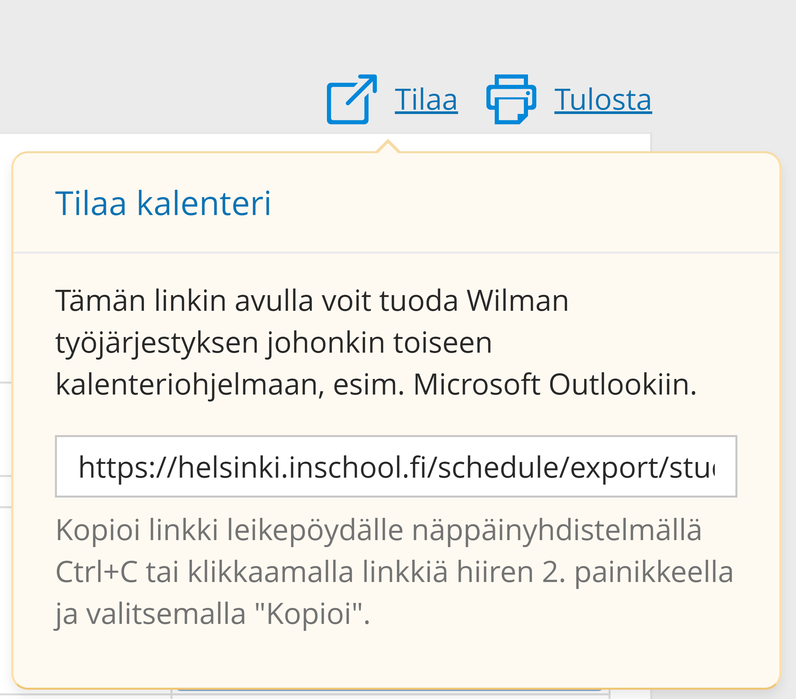
5. Linkin pitäisi näyttää tältä, kannattaa nyt liittää linkki esim. osoitekenttään ja muokata sitä hieman.
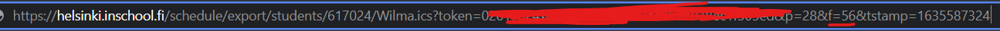  
6. Muokataan linkkiä.
Linkki on tälläinen: https://helsinki.inschool.fi/schedule/export/students/_617024_/Wilma.ics?token=######################&p=28&f=56&tstamp=1635587521 , muuta siitä &f=56& suuremmaksi luvuksi. Tämä osa linkistä indikoi kuinka monta päivää lukujärjestystä näytetään eteenpäin. Luku 56, tarkoittaa 56 päivää  

Valmis linkki, joka näyttää 150 päiväksi eteenpäin olisi: https://helsinki.inschool.fi/schedule/export/students/_617024_/Wilma.ics?token=######################&p=28&f=150&tstamp=1635587521

### 7. Google kalenteri
Mene osoitteeseen: https://calendar.google.com/    

Klikkaa plus-merkkiä

Klikkaa "from URL"
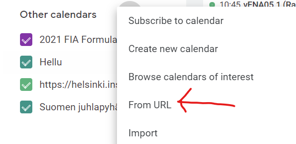
Klikkaa "Add calendar"
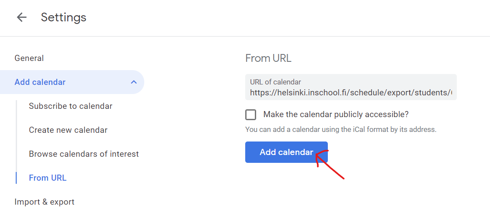
Tadaa! 

### 8. Microsoft Outlook
Mene osoitteeseen: https://outlook.office.com/  
Paina vasemmasta kulmasta kalenterinappulaa.
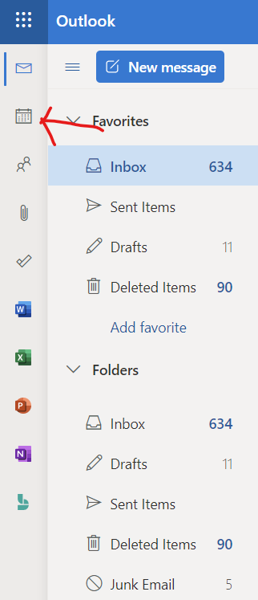
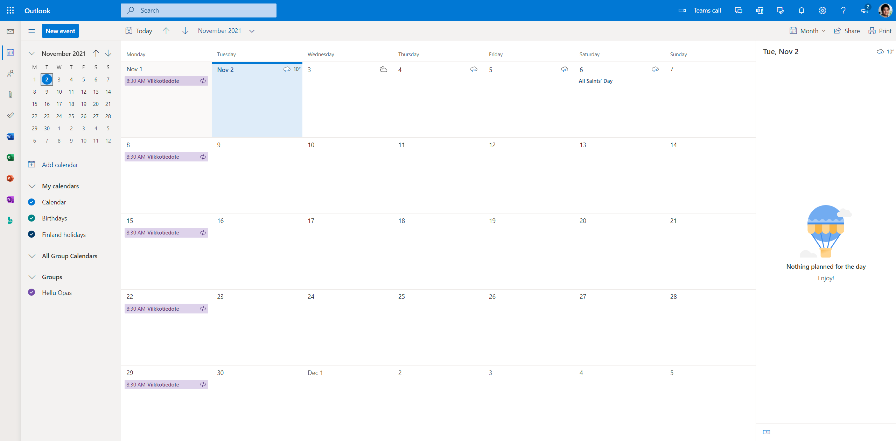
Paina "add calendar"
.png)
Paina "subscribe from the web"
.png)
Syötä linkki, nimeä kalenterisi ja valitse mieluinen väri.
.png)
Valmista!
.png)

### 9. iPhone
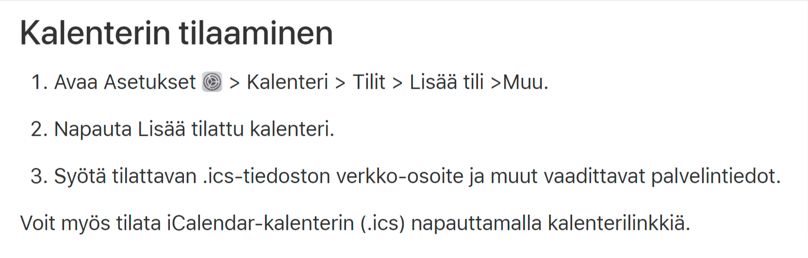
https://support.apple.com/fi-fi/guide/iphone/iph3d1110d4/ios  

**Bonus!** Google kalenterin tapahtumien värien vaihto.  
Vasemmasta alakulmasta etsi juuri lisätty kalenteri. Ja paina nappulaa joka näyttää kolmelta palluralta.
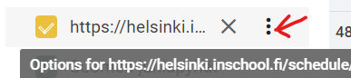
Valitse sitten mieluinen väri. Itse valitsin vihreän, koska se on rauhallinen väri. 💚

Tadaa! Väri vaihdettu!
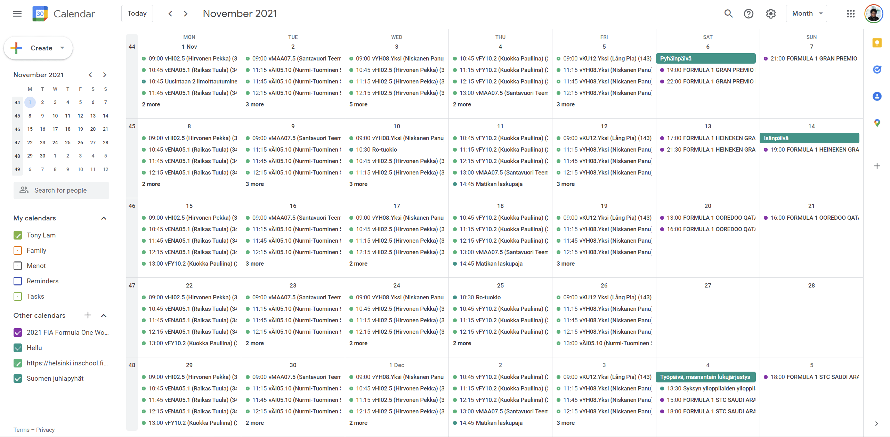

Toivottavasti tämä auttoi :)  

Jos jäi jotain kysyttävää tai epäselväksi, niin alla näkyy sähköpostiosoitteeni mistä voi kysyä!  

Telegram on myös: https://t.me/mangoflamingo