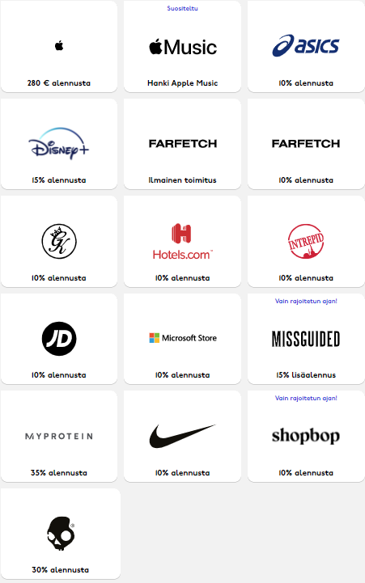

Ilmaiset ohjelmistot saat käyttämällä edu.hel.fi sähköpostitunnusta.

### Ilmaiset:

#### Github student pack
https://education.github.com/pack

Monia ilmaisia ohjelmistoja esimerkiksi:

* Ilmainen verkkotunnus
* Ilmainen Github Pro
* Vuodeksi [Canva Pro](https://www.canva.com/pro/)
* [Gitkraken Pro](https://www.gitkraken.com/github-student-developer-pack)
* [Typeform Pro](https://www.typeform.com/pricing/) vuodeksi

#### Autodesk tuoteperhe ilmaiseksi, etusi jopa 500€

https://www.autodesk.com/education/edu-software/overview

### Alennukset:

#### Evernote -50%

https://evernote.com/students

#### Norton antivirus -75%

https://us.norton.com/student-discount

#### Unidays-palvelun alennukset

https://www.myunidays.com/FI/fi-FI

Kaikki alennukset ovat vain netissä

